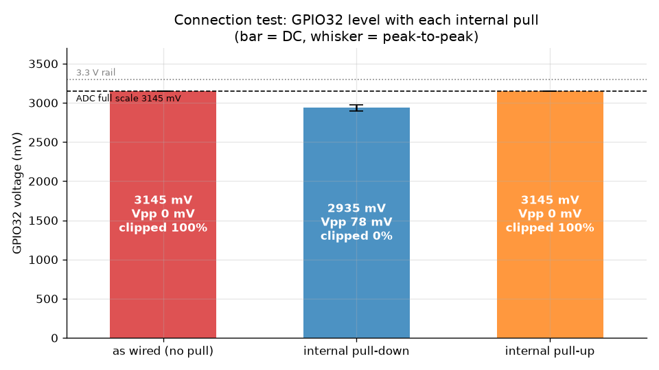
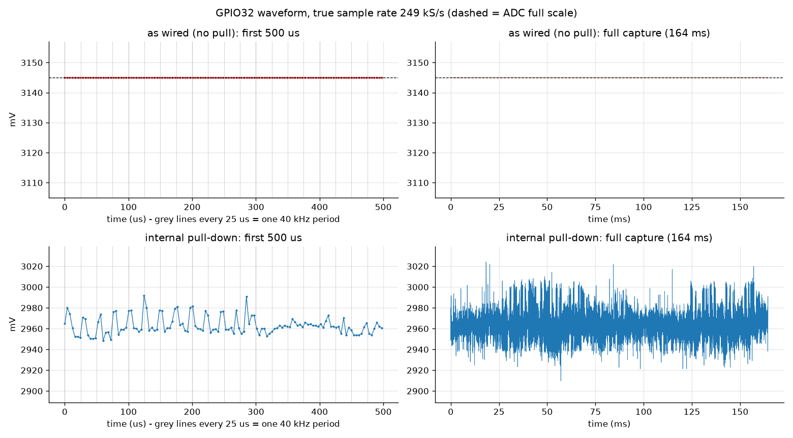
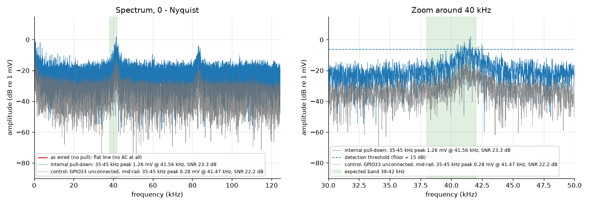
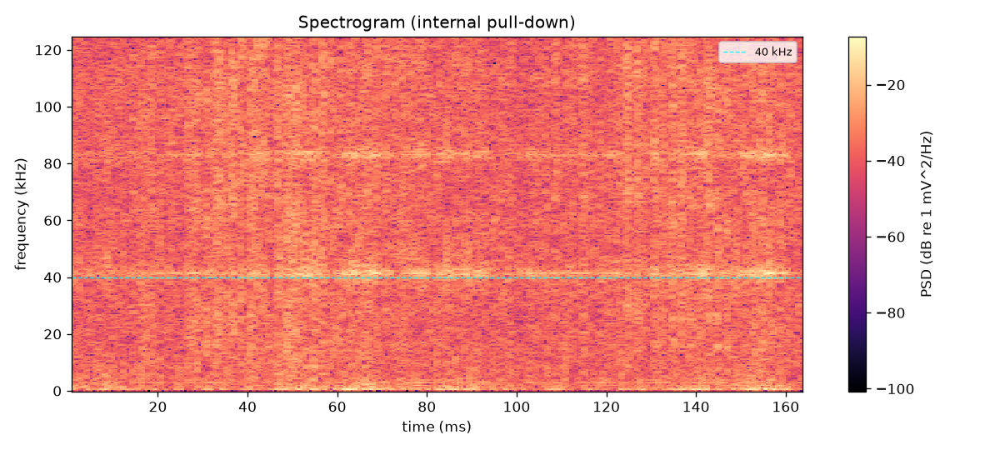
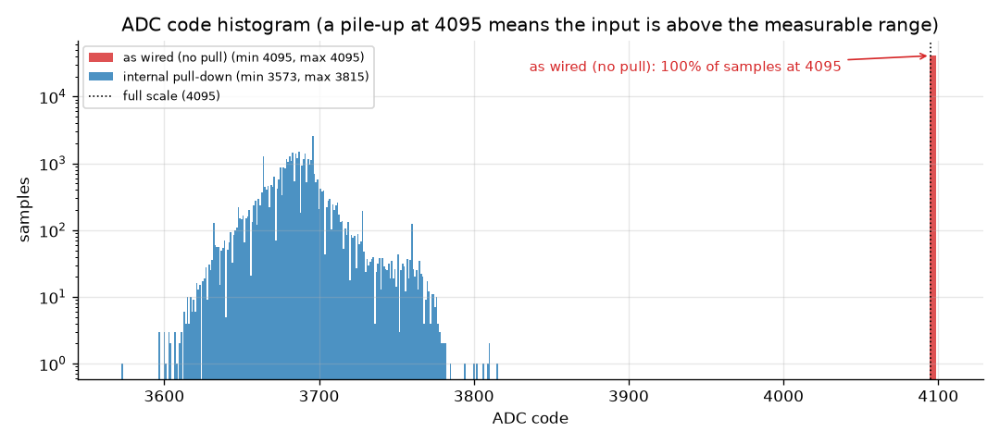
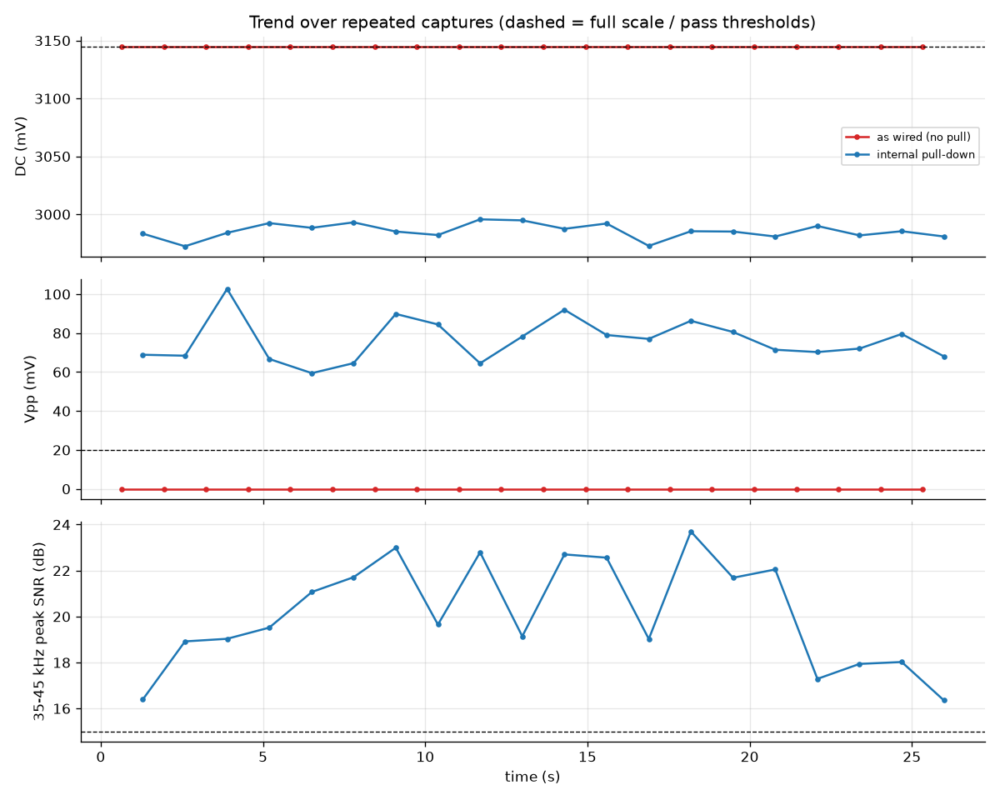
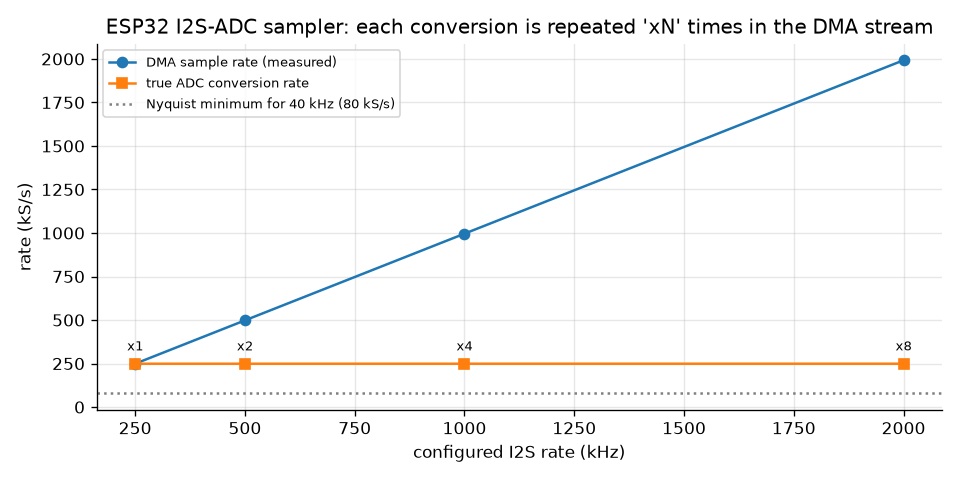
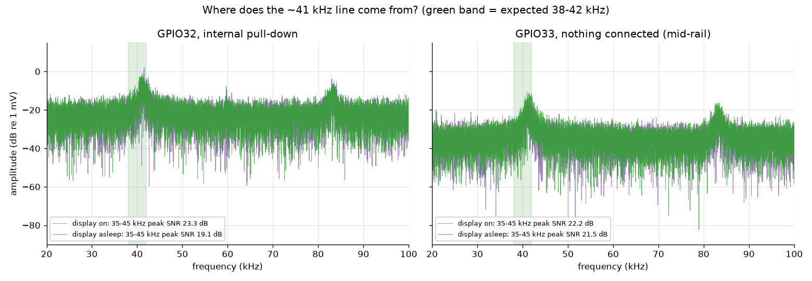

# GPIO32 ultrasonic signal check

- **Date:** 2026-10-02T16:31:03
- **Board:** LilyGO T-Display v1.1 (ESP32-D0WDQ6-V3), firmware `ultrasonic_probe`
- **Input:** GPIO32 = ADC1 channel 4, 12 dB attenuation (range ~142-3145 mV, eFuse-calibrated)
- **Sampler:** I2S built-in ADC DMA, configured 250 kHz, true conversion rate **249.0 kS/s** (6.2 samples per 40 kHz period)

## Verdict: FAIL - no usable 40 kHz signal on GPIO32

- As wired, 100.0% of samples sit at the ADC limit (codes 4095-4095, full scale = 3145 mV). The input is at or above the measurable range, so no AC component can be seen.
- As wired, peak-to-peak amplitude is 0.0 mV (< 20 mV).
- As wired, no tone stands out in the 35-45 kHz search band.

### Supporting evidence

- Hardware edge counter (PCNT, digital input) counted **0 edges in 1 s** at boot: the pin never crossed the logic threshold.
- Independent `analogRead()` check at boot: mean code 4095 (~3145 mV), range 4095-4095.
- With the internal ~45 kOhm pull-down the pin only drops by ~210 mV to 2935 mV: GPIO32 is **actively driven high**, not floating.
- If that node is tied to 3.3 V, its source resistance is roughly 5.6 kOhm (rough estimate: the internal pull value varies +-50 %). That is the signature of a pull-up resistor (4.7 kOhm is a standard value) with nothing pulling the line down.
- With the pull-down (signal brought into range) a tone **is** visible at 41557 Hz, 1.26 mV amplitude, SNR 23.3 dB.
- The ~41 kHz line also appears on GPIO33, where nothing is connected (0.28 mV at 41.47 kHz, SNR 22.2 dB), even with the display asleep: at least part of it is coupled through the shared supply/ground (board or external circuit), not carried by the GPIO32 signal.
- On GPIO32 that line averages 1.05 mV, 3.7x the unconnected pin (0.28 mV): part of it probably arrives through the GPIO32 wire, i.e. a ~41 kHz source may be running upstream. Even so, it is about a millivolt on a line pinned at the top of the range, not a usable receiver signal.
- With the display asleep, GPIO32 (internal pull-down) still shows 35-45 kHz component (best peak 0.85 mV at 41.18 kHz, SNR 19.1 dB).

## What to check on the hardware

1. **Measure GPIO32 with a multimeter** while the ultrasonic circuit runs. A properly biased analog receiver output idles near mid-supply (~1.65 V on 3.3 V). About 3.3 V means the output is stuck at the rail. **Above 3.6 V means the module runs from 5 V: disconnect it**, because it can damage the ESP32 (power it from 3.3 V, or add a resistor divider).
2. **Check what GPIO32 is wired to.** The measurement looks like a ~4.7 kOhm pull-up to 3.3 V with nothing driving the line. That fits a wire landing on the module's VCC/pull-up pin instead of the amplifier output, or an open-collector comparator output (e.g. LM393) that never switches.
3. **If the module outputs a comparator/echo signal** (idle high, pulled low only when an echo is detected), it never toggled here: 0 edges counted in 1 s. Check that the transmitter fires and that something reflects back to the receiver.
4. **If it is meant to be an analog amplifier output,** check its bias: the amplifier needs a mid-supply reference (VCC/2 divider) and the transducer must be AC-coupled through a capacitor. A missing or shorted coupling capacitor, a wrong bias or too much gain drives the output to the positive rail.
5. **Check the 40 kHz source on its own** with an oscilloscope at the transmitter and at the receiver output, before the ESP32. The faint ~41 kHz line seen here also shows up on an unconnected pin, so it cannot confirm the transmitter is running.

## Measurements

| Capture | DC (mV) | Vpp (mV) | AC RMS (mV) | Clipped | Code range | 35-45 kHz peak (freq / amplitude / SNR) |
|---|---|---|---|---|---|---|
| as wired (no pull) #0 | 3145 | 0.0 | 0.00 | 100.0 % | 4095-4095 | n/a (flat line) |
| as wired (no pull) #1 | 3145 | 0.0 | 0.00 | 100.0 % | 4095-4095 | n/a (flat line) |
| internal pull-down #0 | 2964 | 75.1 | 9.87 | 0.0 % | 3573-3815 | 41.56 kHz / 1.26 mV / 23.3 dB |
| internal pull-down #1 | 2978 | 78.5 | 9.72 | 0.0 % | 3600-3852 | 41.06 kHz / 1.02 mV / 21.4 dB |

Pass criteria (as wired): clipped < 0.1 %, Vpp >= 20 mV, a tone >= 15 dB above the local noise floor inside 38-42 kHz.

### Connection test

| Pull | DC (mV) | Vpp (mV) | Clipped |
|---|---|---|---|
| as wired (no pull) | 3145 | 0.0 | 100.0 % |
| internal pull-down | 2935 | 78.0 | 0.0 % |
| internal pull-up | 3145 | 0.0 | 100.0 % |

### Interference controls

GPIO33 has nothing connected; with both internal pulls it sits at mid-rail through ~22 kOhm. The display is put to sleep with `SLPIN`, which also stops its internal charge pumps.

| Capture | Pin | Pull | Display | DC (mV) | Vpp (mV) | 35-45 kHz peak (freq / amplitude / SNR) |
|---|---|---|---|---|---|---|
| gpio33_floating | GPIO33 | none | on | 142 | 0.0 | n/a (flat line) |
| gpio33_display_on | GPIO33 | both | on | 1454 | 14.9 | 41.47 kHz / 0.28 mV / 22.2 dB |
| gpio33_display_off | GPIO33 | both | asleep | 1455 | 19.0 | 40.98 kHz / 0.29 mV / 21.5 dB |
| gpio32_display_off | GPIO32 | down | asleep | 2981 | 90.2 | 41.18 kHz / 0.85 mV / 19.1 dB |

### Sampler sweep

The ESP32 I2S-ADC path repeats each conversion several times in the DMA stream. The true rate is the DMA rate divided by that repeat factor.

| Configured (kHz) | DMA rate (kS/s) | Repeat | True rate (kS/s) |
|---|---|---|---|
| 250 | 249.0 | 1 | 249.0 |
| 500 | 498.1 | 2 | 249.0 |
| 1000 | 996.2 | 4 | 249.0 |
| 2000 | 1992.5 | 8 | 249.1 |

Boot info: `PCNT counts per 250 ms gate = 0,0,0,0`, `analogRead mean = 4095.0`, `ADC cal = efuse_vref (Vref 1114 mV)`.

## Graphs

Raw captures: `data/*.npz` (`words` = raw 16-bit DMA words, `codes`/`mv` = un-swapped true samples, `fs` = true sample rate).
Re-run: `cd ultrasonic_probe && uv run tools/analyze_signal.py`.
